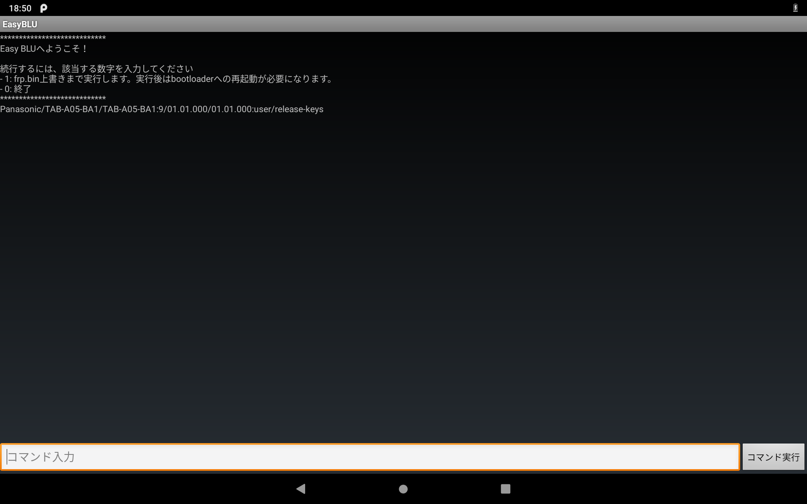

# Easy Bootloader Unlock

このアプリケーションは、チャレンジパッド Neo/Next のブートローダをアンロックすることができます。

## 利用方法

[SetupLogin](https://kobold831.github.io/SetupLogin/)から簡単に利用できるようになりました。

+ [SetupLogin](https://kobold831.github.io/SetupLogin/)にあるとおりにセットアップをしてください。
+ EasyBLUを選択して続行します。
+ このアプリが起動します。

エクスプロイトの発動に失敗してデバイスが再起動した場合は、ホームとしてEasyBLUを選択すると、起動時にこのアプリが起動します。

## 注意事項

> [!CAUTION]
> このアプリケーションが起因した一切の問題を開発者は責任を負いません。

> [!WARNING]
> 実行中はデバイスに触れないでください。

デバイスが再起動してしまった場合は、エクスプロイトの発動に失敗しています。アプリのバグではなく仕様ですので、デバイスが起動したら再度実行してください。

最後まで処理が終了したら、ADB から以下のコマンドを実行して **bootloader** モードに入ってください。
```
adb reboot bootloader
```
次のコマンドを実行して、音量のプラスボタンを押すと、５秒程度でブートローダがアンロックされます。
```
fastboot flashing unlock
```

## 対応機種

- チャレンジパッド Neo
- チャレンジパッド Next

## サンプル画像

[](#)

## 外部ライブラリー

このアプリは以下のライブラリーを使用しています。

- app/src/main/assets/**shrinker**  
  [**CVE-2022-38181**](https://github.com/SmileTabLabo/CVE-2022-38181)
